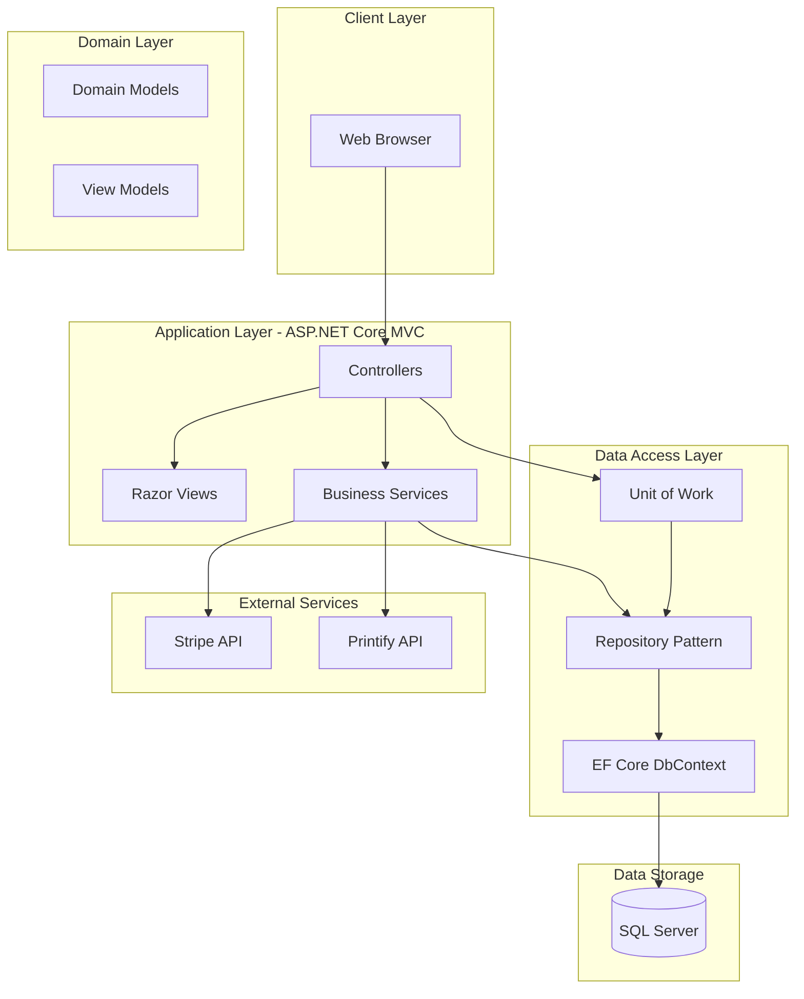
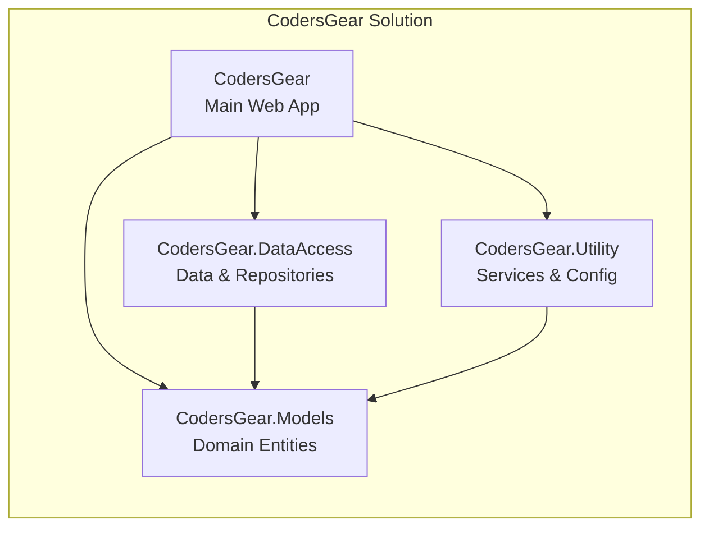
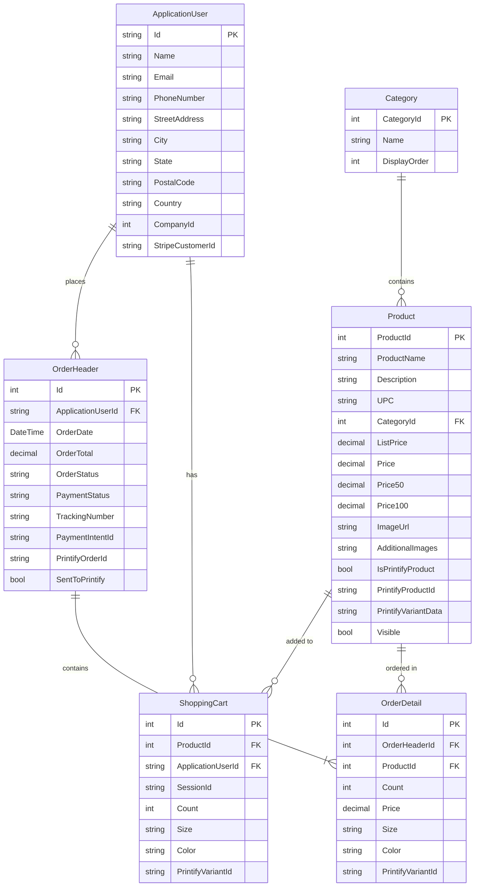
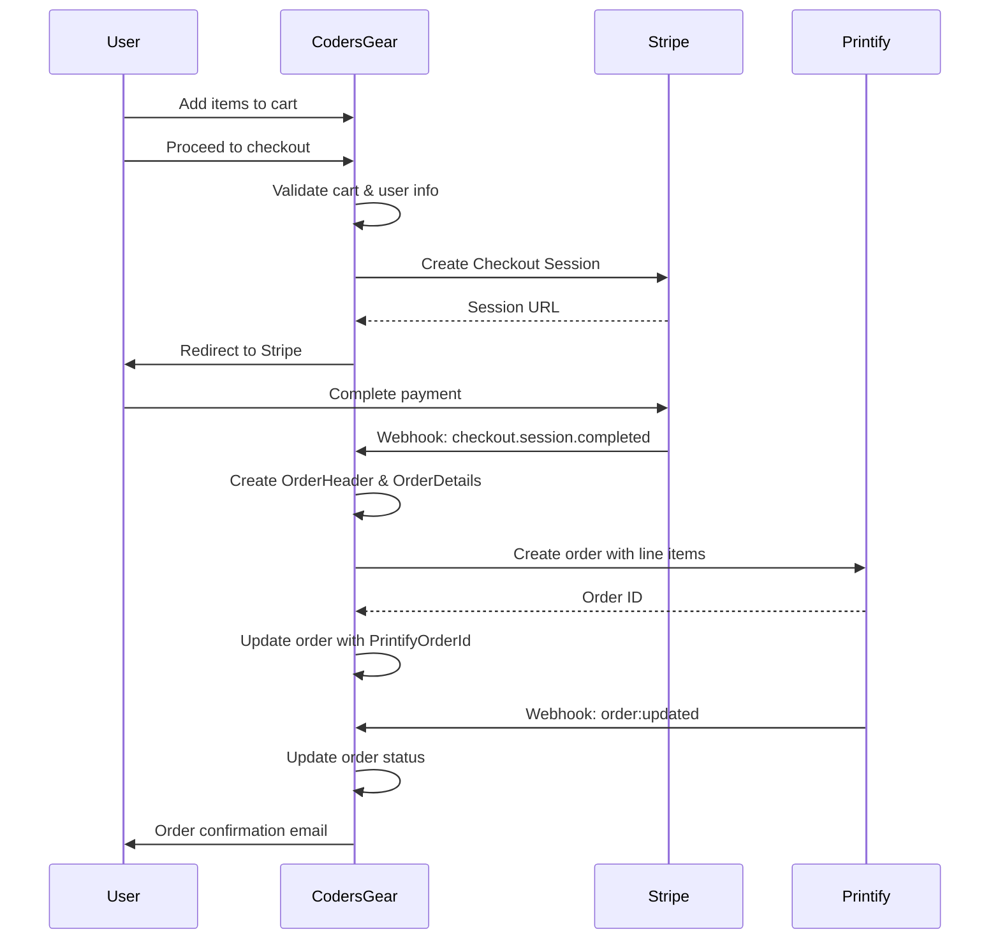
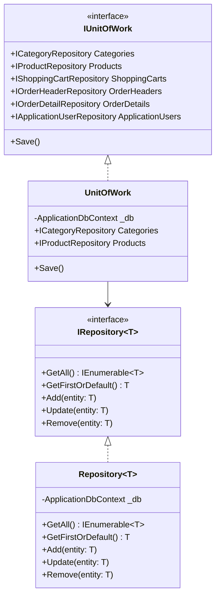

# CodersGear

<div align="center">


**A Full-Stack E-Commerce Platform for Print-on-Demand Merchandise**

[Features](#features) • [Architecture](#architecture) • [Tech Stack](#tech-stack) • [Getting Started](#getting-started)

</div>

---

## Overview

CodersGear is a production-ready e-commerce web application built with ASP.NET Core MVC, designed for selling print-on-demand merchandise. The platform integrates with **Stripe** for secure payment processing and **Printify** for automated order fulfillment, demonstrating enterprise-level architecture patterns and real-world API integrations.

### Key Highlights

- **Full-Stack Development**: Complete MVC application with server-side rendering, RESTful APIs, and modern frontend
- **Payment Integration**: Secure checkout flow with Stripe, including webhook handling for async payment events
- **Third-Party API Integration**: Bi-directional sync with Printify API for product management and order fulfillment
- **Clean Architecture**: Repository pattern, Unit of Work, dependency injection, and separation of concerns
- **Production Considerations**: Environment-specific configuration, comprehensive error handling, and security best practices

---

## Features

### Customer-Facing

| Feature | Description |
|---------|-------------|
| **Product Catalog** | Browse products by category with pagination and filtering |
| **Product Variants** | Select size and color options for each product |
| **Tiered Pricing** | Automatic price breaks at 1-50, 50+, and 100+ units |
| **Shopping Cart** | Persistent cart for guests (session) and authenticated users |
| **Guest Checkout** | Complete purchases without account creation |
| **Secure Payments** | Stripe Checkout with PCI-compliant payment processing |
| **Order Tracking** | View order history and fulfillment status |

### Administrative

| Feature | Description |
|---------|-------------|
| **Product Management** | Full CRUD operations with image uploads |
| **Category Management** | Organize products into categories |
| **Printify Sync** | One-click product import from Printify catalog |
| **Webhook Management** | Configure and monitor Printify webhooks |
| **Background Sync** | Automatic product synchronization service |

---

## Architecture

### System Architecture



### Project Structure



### Database Schema



### Order Processing Flow



---

## Tech Stack

### Backend

| Technology | Version | Purpose |
|------------|---------|---------|
| .NET | 10.0 | Application framework |
| ASP.NET Core MVC | 10.0 | Web framework |
| Entity Framework Core | 10.0 | ORM & database access |
| ASP.NET Core Identity | 10.0 | Authentication & authorization |
| SQL Server | 2022 | Primary database |

### Frontend

| Technology | Purpose |
|------------|---------|
| Razor Views | Server-side rendering |
| Bootstrap 5 | CSS framework |
| jQuery | DOM manipulation & AJAX |
| Bootstrap Icons | Icon library |

### Integrations

| Service | SDK/Method | Purpose |
|---------|------------|---------|
| Stripe | Stripe.NET 50.4.0 | Payment processing |
| Printify | REST API | Print-on-demand fulfillment |

### Development Tools

| Tool | Purpose |
|------|---------|
| Visual Studio 2022 / VS Code | IDE |
| dotnet CLI | Build & run |
| Entity Framework Migrations | Database schema management |

---

## Getting Started

### Prerequisites

- [.NET 10.0 SDK](https://dotnet.microsoft.com/download/dotnet/10.0)
- [SQL Server](https://www.microsoft.com/en-us/sql-server/sql-server-downloads) (LocalDB, Express, or full instance)
- [Stripe Account](https://stripe.com) (for payments)
- [Printify Account](https://printify.com) (for fulfillment)

### Installation

1. **Clone the repository**
   ```bash
   git clone https://github.com/AgenticTony/CodersGear.git
   cd CodersGear
   ```

2. **Configure connection string**

   Update `appsettings.Development.json`:
   ```json
   {
     "ConnectionStrings": {
       "DefaultConnection": "Server=(localdb)\\mssqllocaldb;Database=CodersGearDb;Trusted_Connection=True;MultipleActiveResultSets=true"
     }
   }
   ```

3. **Configure API keys**

   Update `appsettings.Development.json`:
   ```json
   {
     "Stripe": {
       "SecretKey": "sk_test_...",
       "PublishableKey": "pk_test_..."
     },
     "Printify": {
       "ApiToken": "your-printify-api-token",
       "ShopId": "your-shop-id"
     }
   }
   ```

4. **Apply database migrations**
   ```bash
   cd CodersGear
   dotnet ef database update
   ```

5. **Run the application**
   ```bash
   dotnet run
   ```

6. **Access the application**

   Navigate to `https://localhost:5001` or `http://localhost:5000`

---

## Design Patterns

### Repository Pattern with Unit of Work



### Dependency Injection Configuration

All services are registered in `Program.cs` following the Dependency Inversion Principle:

```csharp
// Repository Pattern
services.AddScoped<IUnitOfWork, UnitOfWork>();

// Application Services
services.AddScoped<IEmailSender, EmailSender>();
services.AddScoped<IPrintifyService, PrintifyService>();
services.AddScoped<IPrintifyProductSyncService, PrintifyProductSyncService>();
services.AddScoped<IPrintifyOrderService, PrintifyOrderService>();
services.AddScoped<IWebhookSignatureVerifier, WebhookSignatureVerifier>();

// Background Services
services.AddHostedService<PrintifyBackgroundSyncService>();
```

---

## API Integrations

### Stripe Integration

The application integrates with Stripe for secure payment processing:

- **Checkout Sessions**: Redirect-based payment flow
- **Webhooks**: Real-time payment status updates
- **Customer Management**: Stripe customer ID storage for repeat purchases

### Printify Integration

Full Printify API integration for print-on-demand fulfillment:

| Endpoint | Purpose |
|----------|---------|
| `GET /shops` | List available shops |
| `GET /shops/{id}/products` | Fetch products for sync |
| `POST /orders` | Create fulfillment orders |
| `POST /webhooks` | Register webhook endpoints |

### Webhook Security

Both Stripe and Printify webhooks are verified using HMAC-SHA256 signature validation to prevent replay attacks and ensure request authenticity.

---

## Security Features

| Feature | Implementation |
|---------|---------------|
| **Authentication** | ASP.NET Core Identity with secure password hashing |
| **Authorization** | Role-based access (Customer, Company, Admin, Employee) |
| **CSRF Protection** | Built-in MVC antiforgery tokens |
| **SQL Injection** | Parameterized queries via Entity Framework |
| **XSS Prevention** | Razor automatic HTML encoding |
| **Webhook Verification** | HMAC-SHA256 signature validation |
| **HTTPS Enforcement** | Production redirects to HTTPS |
| **Secrets Management** | Environment-specific configuration |

---

## Project Structure

```
CodersGear/
├── CodersGear/                          # Main web application
│   ├── Areas/
│   │   ├── Admin/                       # Admin area
│   │   │   ├── Controllers/             # Category, Product, Webhook
│   │   │   └── Views/
│   │   ├── Customer/                    # Customer-facing area
│   │   │   ├── Controllers/             # Home, Cart
│   │   │   └── Views/
│   │   └── Identity/                    # ASP.NET Identity pages
│   │       └── Pages/Account/
│   ├── Controllers/                     # Root controllers (Webhooks)
│   ├── Services/                        # Business logic services
│   ├── Views/Shared/                    # Layouts and partials
│   └── wwwroot/                         # Static files
│
├── CodersGear.DataAccess/               # Data access layer
│   ├── Data/
│   │   └── ApplicationDbContext.cs      # EF Core DbContext
│   ├── Migrations/                      # Database migrations
│   └── Repository/                      # Repository implementations
│       └── IRepository/                 # Repository interfaces
│
├── CodersGear.Models/                   # Domain models
│   ├── ApplicationUser.cs
│   ├── Category.cs
│   ├── Product.cs
│   ├── ShoppingCart.cs
│   ├── OrderHeader.cs
│   ├── OrderDetail.cs
│   └── ViewModels/
│
└── CodersGear.Utility/                  # Utilities & services
    ├── SD.cs                            # Status constants
    ├── EmailSender.cs
    ├── PrintifyService.cs
    ├── StripeSettings.cs
    └── WebhookSignatureVerifier.cs
```

---

## Database Migrations

The project uses Entity Framework Core migrations for database schema management. Key migrations include:

| Migration | Description |
|-----------|-------------|
| AddCategoryTableDb | Initial categories table |
| AddProductsToDb | Products with pricing tiers |
| addIdentityTables | ASP.NET Identity schema |
| extendIdentityUser | Address fields on user |
| addShoppingcartToDb | Shopping cart table |
| addOrderHeaderAndOrderDetailsToDb | Orders schema |
| addPrintifyApiSetup | Printify integration fields |
| AddVariantFieldsToCartAndOrder | Size/color variants |

---

## License

This project is available for portfolio demonstration purposes.

---

<div align="center">

**Built with .NET 10.0 by [Tony Foran](https://github.com/AgenticTony)**

</div>
